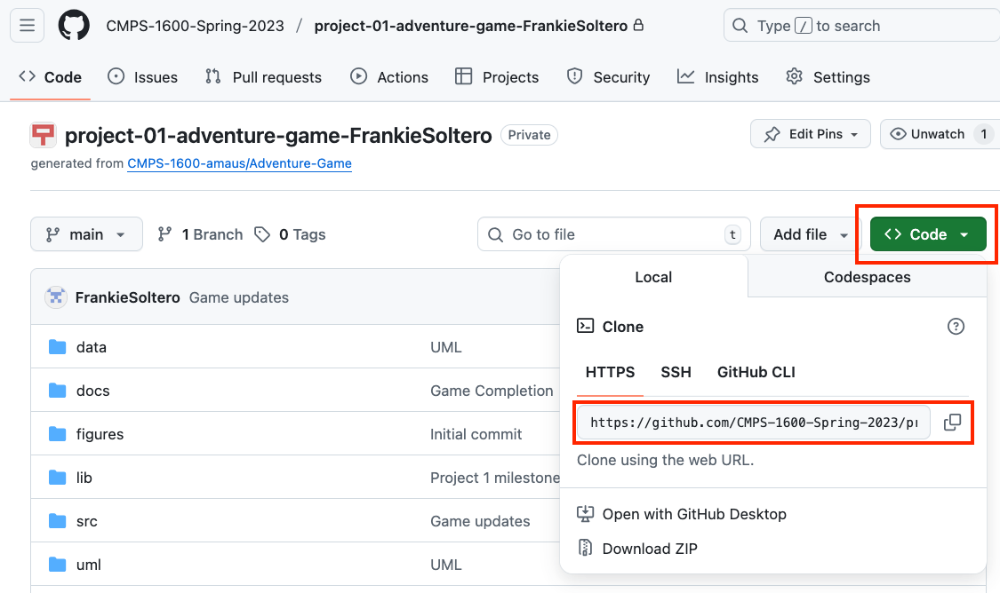
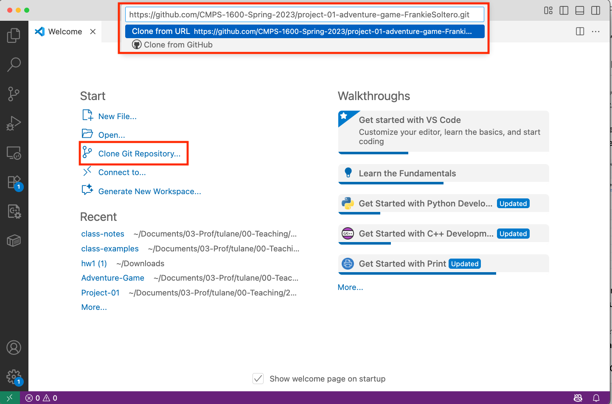
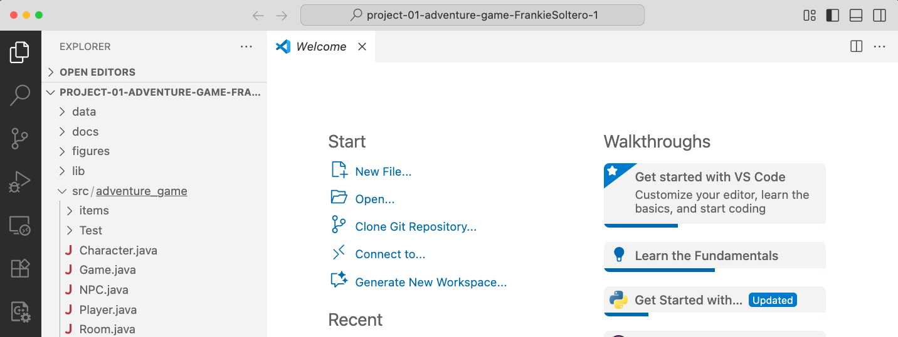
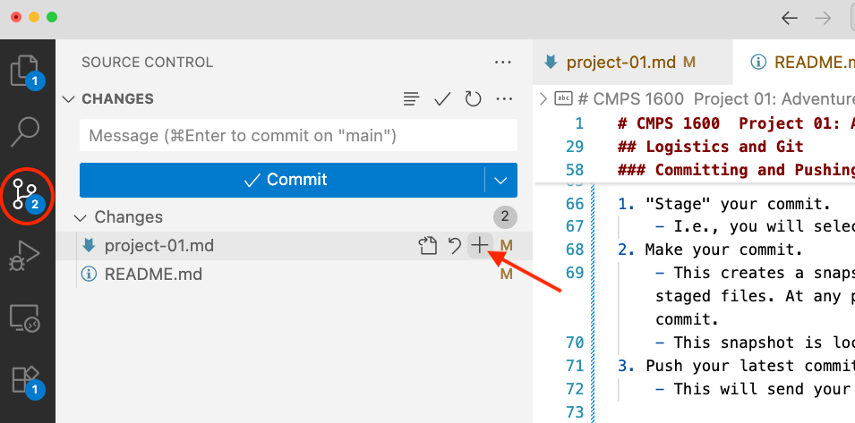
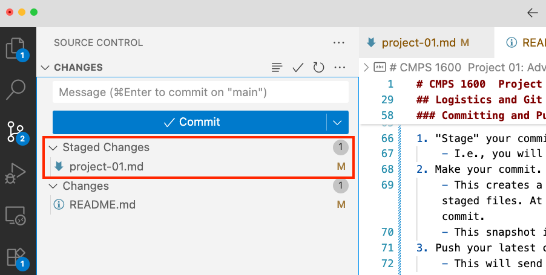
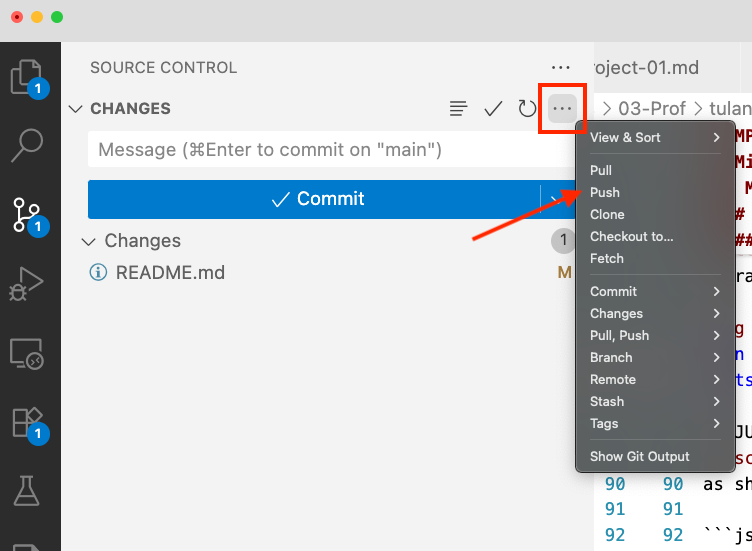
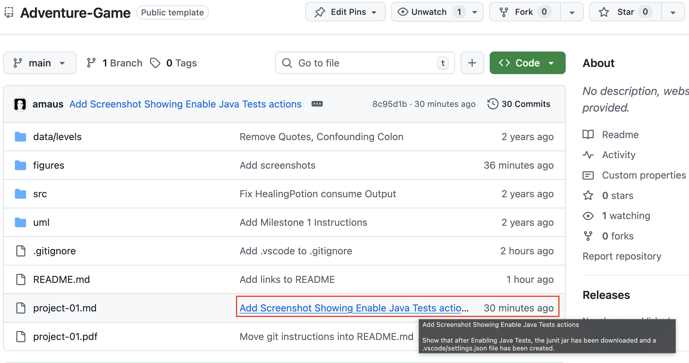

# CMPS 1600  Project 01: Adventure Game

In this project, you will continue the implementation of our text-based
adventure game

To complete this lab, follow the instructions in [project-01.md](project-01.md)
([PDF version](project-01.pdf)).

## Special Instructions, Unique Features, Bonus Features

Document any necessary instructions for running your game, unique features
you implemented, or bonus features you implemented here.

...

## Submitting your work

- Put your name at the top of `Game.java`.
- Push your latest changes to GitHub

Make it as easy as possible for the graders to grade your projects. Add all
special instructions they should know above. E.g, any special instructions on
running your game. You should also detail any special decisions you made, like
replacing certain mechanics with your own. Finally, tell the graders about all
bonus opportunities that you implemented.

Do these things, and you will receive all credit that you deserve.

## Logistics and Git

### Accepting and Cloning your project

This project is hosted on GitHub classrooms. Accept this assignment using the
invitation link posted on the Canvas Assignment "Project 1 - Milestone 1".

Once you have accepted the assignment, a private repository containing the
template code will be created for you. The next step is to clone it to your
computer.

Open your respository on GitHub and copy the clone link from the green "<> Code"
button.

 Code button">

Open a new VS Code window and clone your repository. Click on "Clone Git
Repository", enter your clone link in the text box that opens at the top of
the window, choose a location to save your repository on your computer, and
finally open your cloned repository.

Now you have your repository on your computer and you are ready to get started
implementing this project!

### Committing and Pushing to GitHub

As you implement you project, you will want "commit" and "push" your changes to
GitHub frequently. When you push your changes, they will be uploaded to GitHub.
If you don't do this, we can't see them and you won't get credit for them!

To push your changes to GitHub, there are three steps:

1. Stage your commit.
    - I.e., you will select the files to include in this update.
2. Make your commit.
    - This creates a snapshot of your project containing the changes in the staged files. 
    - At any point, you can always revisit or revert to a previous commit.
    - This snapshot is local to your computer.
3. Push your latest commit(s) to GitHub
    - This will send your latest commit(s) to your GitHub repository.

Here is what this process looks like in VS Code:

#### Staging a Commit

All git actions are handled through the source control pane, circled on the
left. For this commit, I only want to include changes to `project-01.md` so I
hover over that file and click on "+" to add this file to a list of staged
files.

> If multiple files have been edited since you last commit, you can choose
which to include. I don't want to include changes to `README.md` because I'm
actively working on this file and am not ready to send my work to GitHub.

After staging `project-01.md`:

`project-01.md` has been added to the "stage". I'm only adding a single file
to the stage for this commit, but you can add as many files as you like to a
commit.

#### Making the Commit

To make the actual commit, add a commit message to the "Message" box and
click on the "Commit" button.

In the editor, you can see the changes I made to `project-01.md`
since my last commit. I opened this view by clicking on the "M" for this file.
This is useful when drafting your commit message to remember what you did!

> A commit message is note that describes what changes were made to the project
in this commit. As you work on a project you will accumulate commits and having
informative messages is a huge boon! Here are the 
[best practices for writing good commit messages.](https://cbea.ms/git-commit/#seven-rules) 

> WARNING: You MUST add a message to every commit. If you click on the Commit
button before typing your message, VS Code will open a file for you to enter
your message in. You will need to add your message to the top of that file, then
save and close it in order to continue.

#### Pushing the changes to GitHub

After making a commit, the last step is to push. From the ellipsis menu, select
"Push". 

After you have pushed, your changes will be visible on GitHub:

> In this screenshot, you can see that GitHub lists the number of commits that
have been made to each project, in this case, 30 commits (under the "<> Code"
button). On every project, this is a link which you can follow to see a list of
all commits to this project. 

### Git Workflow

When you implement a program, it is best to implement it incrementally.
Implement a small piece, compile, test. Repeat until the program is complete.

Your workflow with git should match your workflow with your code. That is, you
should use git in a small incremental fashion as well. After you complete a
small piece of your program, add, commit, and push it to GitHub. Commits are
supposed to be small and discrete. There are two major benefits to working in
this way.

First, by doing so, you build a history of your project. Commits are snapshots
that you can return to. If you deleted something, or need to go back to an old
version, if you have committed it, you can do so. The smaller your commits are,
the more fine-grained control you have over returning to previous versions of
you project.

Second, every time you push to GitHub, you are pushing your latest commits to a
remote backup. If something happens to your local project, or to your computer,
you can restore your project from GitHub. This can and has been a lifesaver
for countless developers.

> TLDR, Just as you compile and test your programs early and often, you should
be committing and pushing your progress as well.

### About GitHub

GitHub is an incredible resource in the world of software development and
computing in general. Many fundamental open-source projects ([linux], [openSSH],
[rust], [python], [tensorflow], [react], [git itself]), personal projects
([shell configurations], [disassembled pokemon red/blue]), historical projects
([DOOM], [MS-DOS], [Apollo 11]), and scientific projects ([AlphaFold], [CERN],
[NCAR], [NASA]), among others are hosted there.

### Learning Git

To learn more about git, we recommend MIT's [Missing Semester's "Version Control (Git)" Page](https://missing.csail.mit.edu/2020/version-control/).

A great reference is the free book [Pro Git](https://git-scm.com/book/en/v2)

You may find [Oh Shit, Git!?!](https://ohshitgit.com/) useful at times.

[linux]:https://github.com/torvalds/linux
[openSSH]:https://github.com/openssh
[rust]:https://github.com/rust-lang/rust
[python]:https://github.com/python
[tensorflow]:https://github.com/tensorflow/tensorflow
[react]:https://github.com/facebook/react
[git itself]:https://github.com/git
[doom]:https://github.com/id-Software/DOOM
[ms-dos]:https://github.com/microsoft/MS-DOS
[Apollo 11]:https://github.com/chrislgarry/Apollo-11
[AlphaFold]:(https://github.com/deepmind/alphafold)
[CERN]:https://github.com/cernopendata
[NCAR]:https://github.com/NCAR
[NASA]:https://github.com/nasa
[shell configurations]:https://github.com/amaus/.configfiles
[disassembled pokemon red/blue]:https://github.com/pret/pokered
